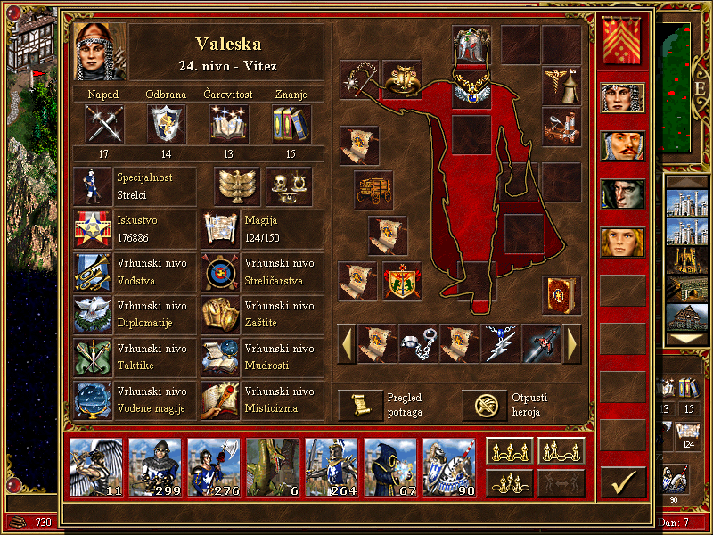
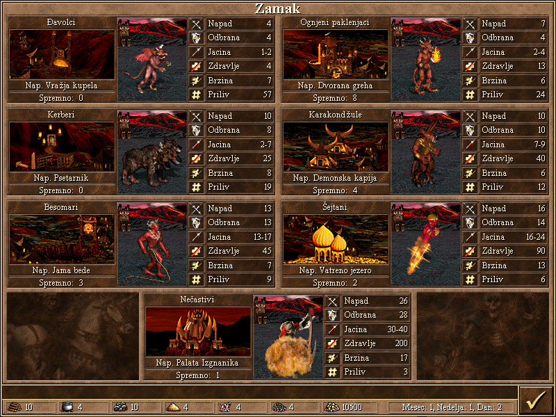

# ⚔ Heroji 3 na srpskom 🇷🇸

 

## Status

Do sada su prevedeni:

- 🐉 Nazivi skoro svih bića u igri
- 🏠 Nazivi svih građevina koje se mogu izgraditi
- 🏙 Tipovi gradova
- 🎯 Nazivi skillova
- 👒 Klase heroja
- 🧙 Nazivi borbenih magija

## Kompatibilnost

✅ Prevodi su testirani i rade sa **Heroes of Might and Magic 3: Complete** ([GOG verzija](https://www.gog.com/en/game/heroes_of_might_and_magic_3_complete_edition)).

❌ Prevodi **ne rade** sa HD Edition verzijom igre koja je dostupna na Steam-u!

## Instalacija

1. Skinuti [poslednju verziju](https://github.com/peacegiverman/homm3-srpski/archive/refs/heads/main.zip) prevoda.
2. Raspakovati arhivu u koren direktorijuma gde su instalirani Heroji.
3. Pokrenite igru i trebalo bi da vidite prevode.
